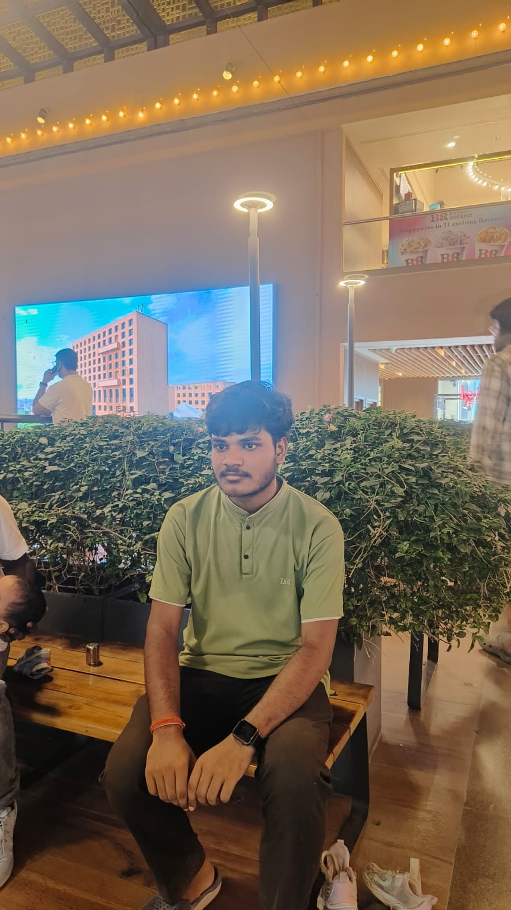

<!-- PROFILE PHOTO -->

  

<h1 align="center">Hi 👋, I'm Rahul Kumar</h1>

<h3 align="center">
  Software Engineer | Web Developer | AI/GenAI Enthusiast | DSA
</h3>

  
  

---

## 🚀 About Me

I'm **Rahul Kumar**, a Computer Science student specializing in **Internet of Things (IoT)** and passionate about building real-world software solutions.

- 💻 Aspiring **Software Development Engineer**
- 🌐 Full-Stack Web Developer
- 🤖 Exploring **AI, Generative AI & AI Agents**
- 🧠 Practicing **Data Structures & Algorithms**
- 🔌 Interested in **IoT & Hardware-Software Systems**
- 🚀 Interested in **Startups, Hackathons & Product Development**
- 🔨 Building practical projects using modern technologies

---

## 🛠️ Tech Stack

### 💻 Programming Languages

  

### 🌐 Web Development

  

### 🗄️ Database

  

### 🤖 AI / GenAI

  

**AI • Generative AI • AI Agents • Computer Vision • OpenAI API • Gemini API**

### 🔌 IoT & Hardware

  

**IoT • ESP32 • Sensors • Embedded Systems**

### ⚙️ Tools & Deployment

  

**Render • Cloudflare • Netlify • Canva**

---

## 📚 Currently Learning

- 🔹 Advanced **DSA & Problem Solving**
- 🔹 **System Design**
- 🔹 **AI Agents & Generative AI**
- 🔹 Advanced Backend Development
- 🔹 Cloud & Deployment
- 🔹 Building scalable startup products

---

## 🚀 Featured Projects

### 🛡️ SafeWay-AI

AI-powered road safety and driver risk analysis platform.

**Features:**
- 😴 Drowsiness Detection
- ⚠️ Driver Risk Analysis
- 🚗 Driving Behavior Analysis
- 🚨 Emergency SOS
- 📊 Driving Safety Score
- 🗺️ Road Hazard Management

**Tech:** `Next.js` `React` `Node.js` `Express` `MongoDB` `Python` `AI` `Computer Vision`

---

### 🌍 RESQ

Damage-aware emergency routing system designed for disaster situations such as floods and earthquakes.

**Features:**
- 🗺️ Damage-aware routing
- 🌊 Flood-aware route analysis
- 🚧 Road hazard detection
- 📍 Geospatial data processing
- 🚑 Emergency route optimization

**Tech:** `React` `Node.js` `Geospatial Data` `Routing` `AI`

---

### ⚡ GridShare

A peer-to-peer energy sharing marketplace for buying and selling available energy within a connected network.

**Features:**
- ⚡ P2P Energy Sharing
- 🔋 Energy Monitoring
- 🗺️ Live Energy Visualization
- 💰 Buy/Sell Energy
- 🔌 IoT-based Monitoring

**Tech:** `React` `Node.js` `MongoDB` `IoT` `ESP32`

---

## 🏆 Hackathons & Innovation

I enjoy participating in hackathons and building solutions for real-world problems.

### Areas I Work On

- 🤖 Artificial Intelligence
- 🛡️ Road & Driver Safety
- 🚨 Disaster Management
- ⚡ Energy Management
- 🌱 Agriculture Technology
- 🔌 IoT Solutions
- 🚀 Startup & Product Development

> **I don't just want to build projects — I want to build solutions that solve real-world problems.**

---

## 📊 GitHub Stats

  

  

  

---

## 🏆 GitHub Trophies

  

---

## 💡 My Goal

> **Build technology that solves real-world problems and turn innovative ideas into scalable products.**

---

## 📫 Connect With Me

---

## 🤝 Open to Opportunities

I'm interested in:

- 💻 Software Development Internships
- 🌐 Full-Stack Development
- 🤖 AI / GenAI Projects
- 🚀 Startup Collaborations
- 🏆 Hackathons
- 🤝 Open Source Contributions

📩 **Email:** rahulmaurya886396@gmail.com

---

<h3 align="center">
  🚀 Build • Learn • Innovate • Repeat
</h3>

  ⭐ If you like my projects, consider giving them a star!

---

  

